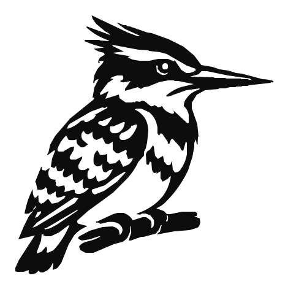
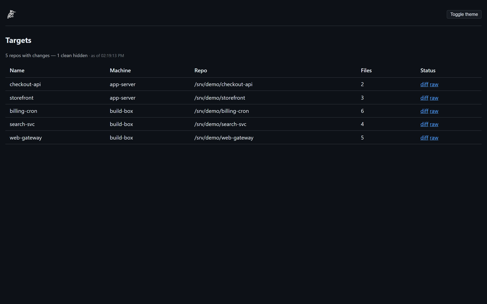
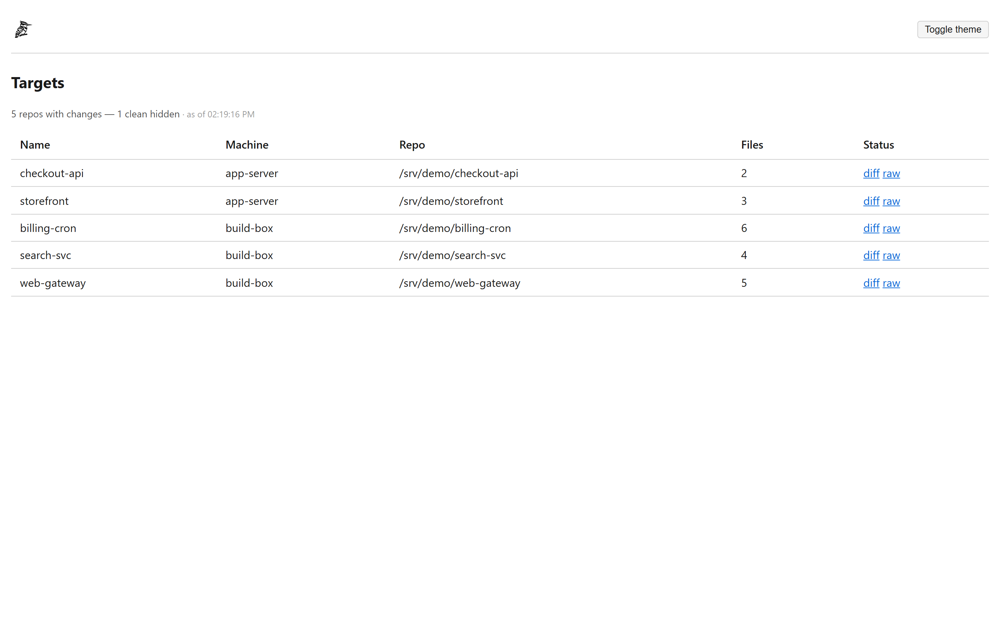
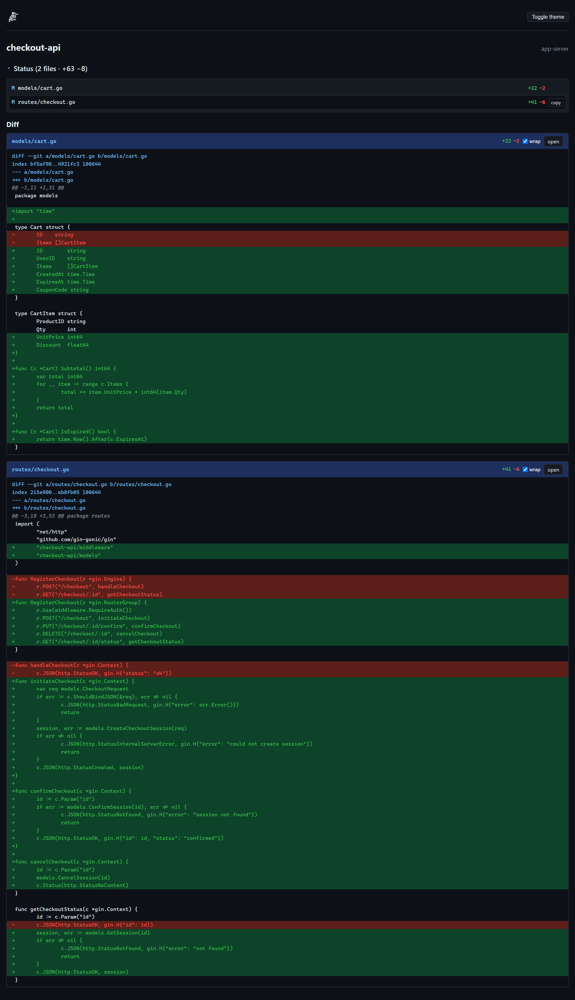
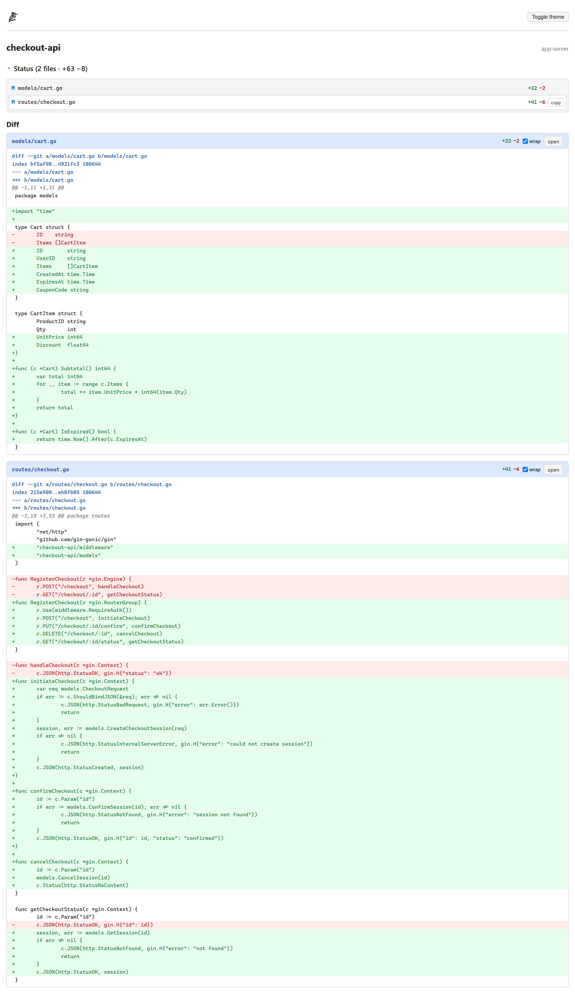

# difflab — see uncommitted working-tree diffs across all your machines, from any browser.

<picture>
  <source media="(prefers-color-scheme: dark)" srcset="img/kingfisher_dark.svg">
  
</picture>

[](https://github.com/OfBirds/difflab/actions/workflows/ci.yml)
[](https://github.com/OfBirds/difflab/releases)
[](LICENSE)

> **Pied Kingfisher** in the [ofbirds](https://ofbirds.org) flock — the pied bird wears two
> colors, like a diff; it hovers over the water and strikes exactly where something moved
> beneath the surface. (difflab stays the technical name on GitHub/GHCR; Pied Kingfisher is the
> product identity.)

**User guide: https://ofbirds.org/docs/kingfisher/** · Product page: https://ofbirds.org/kingfisher

A self-hosted Flask app that shows **uncommitted working-tree diffs** of configured git repos —
the thing Gitea and cgit don't show. Browse any repo's `git diff` output from any device on your
LAN, with diff-colorized (add/del/hunk), collapsible per-file views and dark/light mode.

## Screenshots

The Targets home page — dirty repos across every enrolled machine, in dark and light mode:




A rendered working-tree diff, in dark and light mode:




## Quickstart

```bash
docker run -d \
  --name difflab \
  -p 8747:8747 \
  -v /path/to/your/config.yaml:/app/config.yaml:ro \
  -v difflab-data:/data \
  -e DIFFLAB_DATA=/data \
  -e DIFFLAB_ENROLL_TOKEN=change-this-token \
  ghcr.io/ofbirds/difflab:latest
```

Open <http://localhost:8747>. Full guide: [Getting started](https://ofbirds.org/docs/kingfisher/getting-started.html).

## Enroll a machine

Getting a new machine into difflab takes two commands on the target host.

### Step 1 — authorize the container's key on the target host

**Linux / macOS:**
```bash
curl -s http://difflab.example.com:8747/pubkey >> ~/.ssh/authorized_keys
```

**Windows (PowerShell):**
```powershell
(Invoke-WebRequest http://difflab.example.com:8747/pubkey).Content |
    Add-Content "$env:USERPROFILE\.ssh\authorized_keys"
```

The key is emitted as a ready-to-paste restricted `authorized_keys` line:
```
no-pty,no-agent-forwarding,no-port-forwarding,no-X11-forwarding ssh-ed25519 AAAA... difflab
```

### Step 2 — register the machine

**Linux / macOS:**
```bash
curl -s -X POST http://difflab.example.com:8747/register \
  -H 'Content-Type: application/json' \
  -d '{
    "token": "YOUR_ENROLL_TOKEN",
    "name":  "devbox",
    "host":  "192.0.2.10",
    "user":  "alice",
    "port":  22,
    "roots": ["/home/alice/projects"]
  }'
```

**Windows (PowerShell):**
```powershell
Invoke-RestMethod http://difflab.example.com:8747/register -Method POST `
  -ContentType 'application/json' `
  -Body '{
    "token": "YOUR_ENROLL_TOKEN",
    "name":  "winbox",
    "host":  "192.0.2.20",
    "user":  "alice",
    "port":  22,
    "roots": ["C:/Users/alice/projects"]
  }'
```

`roots` triggers an automatic repo scan (up to 3 levels deep). Pass `repos` instead for an
explicit list.

The response lists discovered targets:
```json
{"machine": "devbox", "targets": ["devbox-myproject", "devbox-other"], "errors": []}
```

Enrolled targets are stored in `$DIFFLAB_DATA/registry.yaml` and survive restarts.

Full guide: [Enrolling machines](https://ofbirds.org/docs/kingfisher/enrollment.html).

### One-time: enable OpenSSH Server on Windows

```powershell
Add-WindowsCapability -Online -Name OpenSSH.Server~~~~0.0.1.0
Set-Service sshd -StartupType Automatic
Start-Service sshd
New-NetFirewallRule -Name sshd -DisplayName 'OpenSSH Server' `
  -Enabled True -Direction Inbound -Protocol TCP -Action Allow -LocalPort 22
```

## Config reference

```yaml
machines:                    # optional
  myserver: user@diffhost.example.com  # name: ssh-destination

targets:                     # required, non-empty
  - name: my-repo            # ^[A-Za-z0-9][A-Za-z0-9._-]*$
    machine: local           # "local" (default) or a machines key
    repo: /path/to/repo
```

Config file is resolved from `$DIFFLAB_CONFIG` env var, then `./config.yaml`.

Full reference: [Configuration reference](https://ofbirds.org/docs/kingfisher/configuration.html).

## Routes

| Route | Description |
|-------|-------------|
| `/` | List of targets with uncommitted changes, plus errored target markers |
| `/d/<name>` | Colorized HTML diff + status |
| `/raw/<name>` | Plain-text diff (`text/plain`) |
| `GET /pubkey` | Container's SSH public key as an `authorized_keys` line |
| `POST /register` | Self-service machine enrollment (token-gated) |

## Security model

- Only two git operations are ever run: `git diff` and `git status --short`.
- All subprocess calls use `shell=False`; repo path is a discrete `-C` argument.
- Remote repos: `ssh -o BatchMode=yes <host> "git -C <quoted-repo> --no-pager diff"` — no
  password prompts.
- Target names are validated at startup (`^[A-Za-z0-9][A-Za-z0-9._-]*$`); unknown targets
  return 404.
- All diff/status output is HTML-escaped before rendering; Jinja autoescape is on.
- 30-second timeout per git/SSH call.
- `/register` is token-gated (`DIFFLAB_ENROLL_TOKEN`); returns 503 if the env var is unset.

Full details: [Security model](https://ofbirds.org/docs/kingfisher/security.html).

## Docker / homelab

```bash
docker build -t difflab .
docker run -d \
  -p 8747:8747 \
  -v /path/to/your/config.yaml:/app/config.yaml:ro \
  -v difflab-data:/data \
  -e DIFFLAB_DATA=/data \
  -e DIFFLAB_ENROLL_TOKEN=change-this-token \
  difflab
```

Or use Compose:

```bash
cp config.example.yaml config.yaml
DIFFLAB_ENROLL_TOKEN=change-this-token docker compose up -d --build
```

The `/data` volume holds the SSH keypair (auto-generated on first run) and `registry.yaml`.

## Development server

```bash
python -m venv .venv
source .venv/bin/activate   # Windows: .venv\Scripts\activate
pip install -r requirements.txt
cp config.example.yaml config.yaml
# edit config.yaml to add your repos
flask --app difflab run --debug
```

## License

**AGPL-3.0-or-later** — see [LICENSE](LICENSE). The source is and stays free software.
